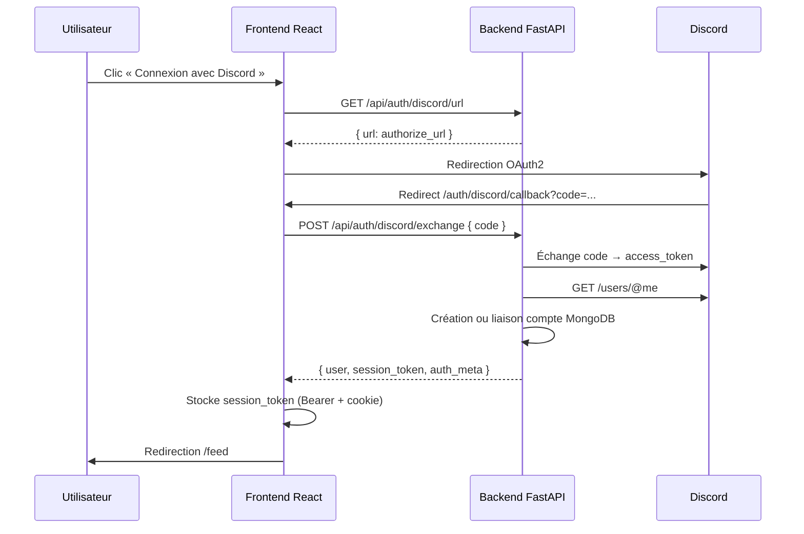

# Configuration Discord OAuth — NEXORIA

Guide pas à pas pour activer la connexion **« Connexion avec Discord »** sur NEXORIA (React + FastAPI + MongoDB).

---

## 1. Créer une application Discord Developer

1. Ouvrez [Discord Developer Portal](https://discord.com/developers/applications).
2. Cliquez sur **New Application**.
3. Donnez un nom (ex. `NEXORIA`) et validez.
4. Dans le menu gauche, ouvrez **OAuth2**.

---

## 2. Récupérer le CLIENT_ID

1. Toujours dans **OAuth2 → General**.
2. Copiez la valeur **Client ID** (identifiant numérique long).
3. Collez-la dans `backend/.env` :

```env
DISCORD_CLIENT_ID=votre_client_id_ici
```

---

## 3. Récupérer le CLIENT_SECRET

1. Dans **OAuth2 → General**, section **Client Secret**.
2. Cliquez sur **Reset Secret** si nécessaire, puis **Copy**.
3. **Ne partagez jamais** ce secret côté frontend ni dans un dépôt public.

```env
DISCORD_CLIENT_SECRET=votre_client_secret_ici
```

---

## 4. Redirect URI à configurer

Discord redirige l'utilisateur vers le **frontend** après autorisation. L'URL doit correspondre **exactement** (protocole, domaine, port, chemin).

### Développement local

| Environnement | Redirect URI |
|---------------|--------------|
| Frontend React (port 3000) | `http://localhost:3000/auth/discord/callback` |

### Production

Remplacez par votre domaine public, par exemple :

```
https://votre-domaine.com/auth/discord/callback
```

### Dans le portail Discord

1. **OAuth2 → Redirects** → **Add Redirect**.
2. Ajoutez l'URL ci-dessus (une entrée par environnement : local + prod si besoin).
3. Enregistrez.

### Dans le backend

```env
DISCORD_REDIRECT_URI=http://localhost:3000/auth/discord/callback
```

> La valeur de `DISCORD_REDIRECT_URI` doit être **identique** à celle enregistrée dans Discord.

---

## 5. Scopes OAuth requis

NEXORIA demande automatiquement :

- `identify` — Discord ID, username, global name, avatar
- `email` — email du compte Discord (création/liaison du profil)

Aucune configuration supplémentaire dans le portail pour ces scopes de base.

---

## 6. Variables `backend/.env`

Copiez `backend/.env.example` vers `backend/.env` et renseignez au minimum :

```env
# ─── Base de données ───
MONGO_URL=mongodb://localhost:27017
DB_NAME=nexoria

# ─── Auth NEXORIA (session_token) ───
JWT_SECRET=changez_moi_une_longue_chaine_aleatoire

# ─── Discord OAuth (obligatoire pour la connexion Discord) ───
DISCORD_CLIENT_ID=
DISCORD_CLIENT_SECRET=
DISCORD_REDIRECT_URI=http://localhost:3000/auth/discord/callback

# ─── Bonus inscription Discord (optionnel, défaut 75) ───
DISCORD_SIGNUP_XP_BONUS=75

# ─── CORS ───
FRONTEND_URL=http://localhost:3000
```

### Variables Discord optionnelles (sync des rôles serveur)

Si vous utilisez la synchronisation des rôles guild (bot) :

```env
DISCORD_BOT_TOKEN=
DISCORD_GUILD_ID=
DISCORD_NOTIFY_CHANNEL_ID=
DISCORD_AUTH_FORUM_CHANNEL_ID=1515325507208745080
```

Le bot poste un **message simple** dans le salon d'inscriptions/connexions (`DISCORD_AUTH_FORUM_CHANNEL_ID`) — pas de fil. Exemples :
- Inscription : `✨ **Pseudo** vient de rejoindre NEXORIA — bienvenue sur le Discord !`
- Connexion : `👋 **Pseudo** s'est connecté à NEXORIA — bienvenue sur le Discord !`
- Déconnexion : `🚪 **Pseudo** s'est déconnecté de NEXORIA — à bientôt sur le Discord !`
- Renommage : `✏️ **AncienPseudo** est devenu **NouveauPseudo** sur NEXORIA`

Ces variables ne sont **pas** requises pour la connexion OAuth utilisateur seule ; elles sont nécessaires pour les annonces forum et la sync des rôles.

---

## 7. Variables `frontend/.env`

Copiez `frontend/.env.example` vers `frontend/.env` :

```env
REACT_APP_BACKEND_URL=http://localhost:8000
REACT_APP_DISCORD_URL=https://discord.gg/votre-invite
```

| Variable | Rôle |
|----------|------|
| `REACT_APP_BACKEND_URL` | URL de l'API FastAPI (sans `/api` final — le client l'ajoute) |
| `REACT_APP_DISCORD_URL` | Lien d'invitation vers le serveur Discord (bouton flottant, maintenance) |

> **Important :** `DISCORD_CLIENT_ID`, `DISCORD_CLIENT_SECRET` et `DISCORD_REDIRECT_URI restent **uniquement côté backend**. Le frontend n'a pas besoin de secrets OAuth.

---

## 8. Flux OAuth complet



### Données Discord stockées sur le profil

| Champ | Description |
|-------|-------------|
| `discord_id` | Identifiant Discord unique |
| `discord_username` | Nom d'utilisateur Discord |
| `discord_global_name` | Display name (global name) |
| `discord_avatar_url` | URL CDN avatar (PNG/GIF) |
| `avatar_url` | Avatar affiché (sync depuis Discord si pas d'upload custom) |

### Session NEXORIA après Discord

Après validation Discord, le backend émet un **`session_token`** NEXORIA :

- Retourné dans la réponse JSON (`session_token`)
- Cookie HTTP `session_token` (httponly)
- Utilisé en header `Authorization: Bearer <token>` par le frontend

C'est le mécanisme d'authentification standard de NEXORIA (identique email/mot de passe et Google). Ce n'est pas un JWT Discord — c'est une session opaque serveur valide 7 jours.

### Bonus à la première inscription via Discord

- **+75 XP** (configurable via `DISCORD_SIGNUP_XP_BONUS`)
- Badge **Héraut Discord** (`discord_herald`)
- Non accordé lors d'une inscription classique email/mot de passe

### Déconnexion

- **Déconnexion NEXORIA** : `POST /api/auth/logout` — invalide la session (bouton déconnexion existant).
- **Délier Discord** : `DELETE /api/auth/discord/unlink` — retire le lien Discord du profil sans supprimer le compte (Paramètres → Compte).

---

## 9. Routes API Discord

| Méthode | Route | Description |
|---------|-------|-------------|
| `GET` | `/api/auth/discord/status` | OAuth configuré ? bonus XP ? |
| `GET` | `/api/auth/discord/url` | URL d'autorisation Discord |
| `POST` | `/api/auth/discord/exchange` | Échange le `code` OAuth → session NEXORIA |
| `DELETE` | `/api/auth/discord/unlink` | Délie Discord (utilisateur connecté) |
| `POST` | `/api/auth/logout` | Déconnexion session |

---

## 10. Vérification rapide

1. Démarrez MongoDB, le backend (`uvicorn server:app`) et le frontend (`npm start`).
2. Ouvrez `http://localhost:3000/login`.
3. Cliquez **Connexion avec Discord**.
4. Autorisez l'application sur Discord.
5. Vous devez être redirigé vers `/feed` avec toast de bienvenue.
6. Vérifiez le profil : avatar Discord + badge Discord si nouvelle inscription.

### Erreurs fréquentes

| Symptôme | Cause probable |
|----------|----------------|
| « Discord OAuth non configuré » | `DISCORD_*` manquants dans `backend/.env` |
| `invalid redirect_uri` | URI Discord ≠ `DISCORD_REDIRECT_URI` |
| `401 token exchange failed` | `CLIENT_SECRET` incorrect ou code déjà utilisé |
| CORS bloqué | `FRONTEND_URL` incorrect dans le backend |

---

## 11. Sécurité

- Ne commitez jamais `.env` (utilisez `.env.example`).
- `DISCORD_CLIENT_SECRET` et `JWT_SECRET` restent serveur uniquement.
- En production : HTTPS obligatoire pour OAuth et cookies `secure`.

---

*Dernière mise à jour : intégration OAuth Discord NEXORIA — inscription, liaison, bonus XP et badge Héraut Discord.*
